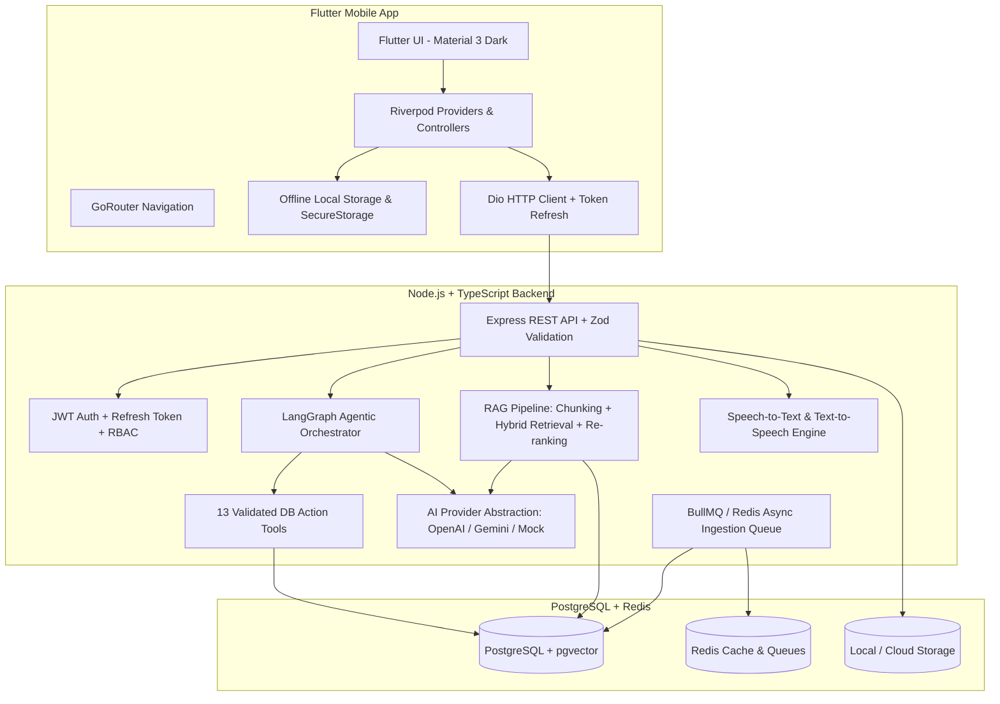

# LearnMate AI — Production-Grade AI Learning Companion 🚀

[](https://flutter.dev)
[](https://nodejs.org)
[](https://www.typescriptlang.org/)
[](https://github.com/pgvector/pgvector)
[](https://redis.io)
[](https://langchain.com)
[](https://vitest.dev)

**LearnMate AI** is a production-grade, AI-powered learning companion mobile application (Flutter + Dart) and backend platform (Node.js + TypeScript + PostgreSQL + pgvector + Redis + BullMQ + LangGraph Agentic Workflows + RAG).

It allows students to upload learning materials (PDF, DOCX, TXT, Slides), ask grounded questions with verifiable source citations, practice with auto-generated quizzes, review 3D spaced-repetition flashcards (SuperMemo SM-2), follow personalized adaptive study calendars, and interact with a voice-enabled AI tutor.

---

## 🌟 Key Features

### 1. 🧑‍🏫 Multi-Mode AI Study Tutor
- Grounded strictly in uploaded student notes to prevent hallucination.
- 5 tailored explanation modes:
  - **Simple**: High-level intuitive analogies.
  - **Detailed / Deep Dive**: Thorough mechanical and theoretical breakdown.
  - **Exam-Focused**: Definitions, high-yield rules, and tricky edge cases.
  - **Beginner-Friendly**: Step-by-step foundation building.
  - **Example-Based**: Concrete real-world code and case studies.
- Verifiable source citations displaying document title, page number, and similarity score.

### 2. 📚 Production Hybrid RAG Pipeline
- Supports **PDF**, **DOCX**, **TXT**, and **Markdown** documents.
- Semantic sliding-window chunker preserving section headers, page numbers, and token counts.
- 1536-dimensional vector embeddings with cosine distance queries via PostgreSQL + `pgvector`.
- Hybrid retrieval combining dense vector similarity with sparse keyword BM25/TF-IDF scoring and weighted re-ranking.

### 3. 🤖 LangGraph Agent & Validated Tool Calling
- Multi-step state machine orchestrating intent classification, context retrieval, tool execution, and grounded answer synthesis.
- 13 validated backend database action tools:
  - `search_materials()`, `get_document()`, `get_topic()`, `generate_quiz()`, `generate_flashcards()`, `get_student_progress()`, `get_weak_topics()`, `get_study_plan()`, `update_study_plan()`, `save_learning_session()`, `get_flashcards()`, `record_quiz_result()`, `calculate_learning_score()`.

### 4. 📝 AI Quiz Generator & Scoring Engine
- Auto-generates structured quizzes (Multiple Choice, True/False, Short Answer, Scenario-based).
- Immediate evaluation, score percentage calculation, detailed question explanations, and automatic identification of weak topics.

### 5. 🃏 3D Animated Flashcards with SuperMemo SM-2
- Smooth 3D flippable card animation with swipe actions.
- Full implementation of the SuperMemo SM-2 spaced repetition algorithm ($EF' = EF + (0.1 - (5 - q) \cdot (0.08 + (5 - q) \cdot 0.02))$) ensuring difficult cards appear more frequently.

### 6. 📅 Personalized Study Plan & Dynamic Rescheduling
- Generates adaptive study timelines based on subject, target exam date, and daily available study hours.
- Dynamic conversational rescheduling: *"Move tomorrow's SQL session to Friday"*.

### 7. 🎙️ Voice AI Tutor (STT & TTS)
- Complete speech-to-text audio transcription and text-to-speech audio synthesis for hands-free learning sessions.

### 8. 📊 Topic Mastery & AI Learning Insights
- Continuous mastery score calculations across all subjects.
- Proactive AI learning insights highlighting streaks, recent improvements, and high-priority study recommendations.

### 9. 📱 Modern Flutter Mobile UI
- Riverpod state management and GoRouter navigation.
- Curated dark/light theme, custom glassmorphism card decorations, Google Fonts typography, and offline-first caching.

---

## 🏗️ System Architecture



---

## 📂 Repository Structure

```
.
├── backend/                              # Node.js + TypeScript Backend Service
│   ├── prisma/
│   │   └── schema.prisma                 # Database schema with pgvector and all entities
│   ├── src/
│   │   ├── config/                       # Environment variables and constants
│   │   ├── database/                     # Prisma singleton, db helpers, and seed data
│   │   ├── middlewares/                  # Auth, RBAC, Error handling, Rate limiting
│   │   ├── modules/
│   │   │   ├── agents/                   # LangGraph learning agent orchestrator
│   │   │   ├── ai/                       # Unified AI provider (OpenAI, Gemini, Mock) & embeddings
│   │   │   ├── auth/                     # JWT authentication, tokens, DTOs
│   │   │   ├── conversations/            # Chat messaging and session history
│   │   │   ├── flashcards/               # Flashcards with SuperMemo SM-2 algorithm
│   │   │   ├── materials/                # Document upload, parsers (PDF/DOCX/TXT), semantic chunker
│   │   │   ├── progress/                 # Topic mastery scoring and AI insights
│   │   │   ├── quizzes/                  # Quiz generation and scoring engine
│   │   │   ├── rag/                      # pgvector cosine similarity + hybrid retrieval
│   │   │   ├── storage/                  # File storage abstraction
│   │   │   ├── study-plans/              # Adaptive study scheduler and AI rescheduling
│   │   │   ├── tools/                    # 13 validated backend database action tools
│   │   │   ├── tutor/                    # Multi-mode AI study tutor
│   │   │   ├── users/                    # Profile and statistics
│   │   │   └── voice/                    # Speech-to-Text (STT) and Text-to-Speech (TTS)
│   │   ├── utils/                        # Logger, Response formatters, AppError
│   │   ├── workers/                      # BullMQ background ingestion worker
│   │   ├── app.ts                        # Express application setup
│   │   └── server.ts                     # HTTP server entry point
│   ├── tests/                            # 16 Vitest test suites (63 passing unit/integration tests)
│   ├── package.json
│   └── tsconfig.json
├── mobile/                               # Flutter Mobile Application
│   ├── lib/
│   │   ├── core/
│   │   │   ├── network/                  # Dio client with JWT interceptor and token refresh
│   │   │   ├── offline/                  # Offline-first caching manager
│   │   │   ├── router/                   # GoRouter configuration
│   │   │   ├── storage/                  # Secure storage and SharedPreferences
│   │   │   └── theme/                    # Modern dark/light curated themes
│   │   ├── features/
│   │   │   ├── auth/                     # Splash, Onboarding, Login, Register screens & Riverpod controller
│   │   │   ├── dashboard/                # Home screen with streak, study plan, and analytics
│   │   │   ├── flashcards/               # 3D animated flashcards with SM-2 ratings
│   │   │   ├── materials/                # Document upload, status badges, chunk viewer
│   │   │   ├── profile/                  # User profile and settings
│   │   │   ├── progress/                 # Topic mastery charts and AI insights
│   │   │   ├── quiz/                     # Quiz catalog, interactive quiz runner, result recap
│   │   │   ├── study_plan/               # Calendar timeline and AI rescheduling
│   │   │   ├── tutor/                    # AI study tutor chat with markdown and citations
│   │   │   └── voice/                    # Voice tutor sheet with microphone visualizer
│   │   └── main.dart                     # ProviderScope and MaterialApp.router
│   ├── test/                             # Flutter widget test suite
│   └── pubspec.yaml
├── docker-compose.yml                    # Multi-container orchestration (Backend, Postgres+pgvector, Redis)
├── Dockerfile                            # Multi-stage production Docker build
└── README.md
```

---

## 📡 REST API Reference

| Method | Endpoint | Description | Auth Required |
|---|---|---|---|
| `POST` | `/api/v1/auth/register` | Register a new student account | No |
| `POST` | `/api/v1/auth/login` | Log in and receive access/refresh tokens | No |
| `POST` | `/api/v1/auth/refresh` | Rotate and issue new access token | No |
| `GET` | `/api/v1/auth/me` | Fetch authenticated user profile | Yes |
| `POST` | `/api/v1/materials/upload` | Upload & chunk study document (PDF/DOCX/TXT) | Yes |
| `GET` | `/api/v1/materials` | List user materials with search & status filters | Yes |
| `GET` | `/api/v1/materials/:id` | Get material details and indexed RAG chunks | Yes |
| `POST` | `/api/v1/conversations/messages` | Send message to AI Learning Agent | Yes |
| `POST` | `/api/v1/tutor/explain` | Get multi-mode concept explanation with citations | Yes |
| `POST` | `/api/v1/tutor/deep-dive` | Get deep-dive theoretical breakdown | Yes |
| `POST` | `/api/v1/quizzes/generate` | Generate structured AI quiz | Yes |
| `POST` | `/api/v1/quizzes/:id/submit` | Submit quiz answers and receive score/feedback | Yes |
| `POST` | `/api/v1/flashcards/generate` | Generate spaced repetition flashcard deck | Yes |
| `POST` | `/api/v1/flashcards/:id/review` | Submit SM-2 review rating (0-5 quality) | Yes |
| `POST` | `/api/v1/study-plans/generate` | Create personalized adaptive study plan | Yes |
| `POST` | `/api/v1/study-plans/:id/reschedule` | Dynamically adjust study timeline via AI | Yes |
| `GET` | `/api/v1/progress/analytics` | Fetch topic mastery scores and AI insights | Yes |
| `POST` | `/api/v1/voice/transcribe` | Transcribe recorded audio query | Yes |
| `POST` | `/api/v1/voice/synthesize` | Convert text to speech audio URL | Yes |
| `POST` | `/api/v1/voice/chat` | Full audio-in / audio-out voice conversation | Yes |

---

## 🛠️ Getting Started

### 1. Backend Setup

```bash
# Navigate to backend directory
cd backend

# Install dependencies
npm install

# Setup environment variables
cp .env.example .env

# Generate Prisma client
npx prisma generate

# Run test suite (63 unit & integration tests)
npm test

# Start development server
npm run dev
```

### 2. Mobile App Setup

```bash
# Navigate to mobile directory
cd mobile

# Fetch Flutter dependencies
flutter pub get

# Run Flutter widget tests
flutter test

# Launch mobile application
flutter run
```

### 3. Docker Deployment

```bash
# Build and launch all services (PostgreSQL + pgvector, Redis, Node.js API)
docker-compose up --build -d
```

---

## 🧪 Testing & Verification Summary

- **Backend Test Suites**: 16 suites passing with 63 unit and integration tests (covering Auth, RBAC, Document Ingestion, Semantic Chunking, Embeddings, pgvector Hybrid RAG, AI Provider Schemas, Validated Tool Calling, LangGraph Learning Agent, Multi-mode Tutor, Quiz Scoring, Flashcard SM-2 Spaced Repetition, Adaptive Study Planner, Progress Mastery, and Voice STT/TTS).
- **Mobile Test Suite**: Flutter unit and widget tests validating application initialization, themes, and screen lifecycles.

---

## 🗺️ Future Roadmap
- [ ] Collaborative study rooms with peer AI tutoring.
- [ ] OCR parsing for handwritten lecture notebooks and whiteboard photos.
- [ ] Native iOS/Android lock screen widgets for daily flashcard review.
- [ ] Multi-lingual speech synthesis for localized tutoring.

---

## 📄 License
This project is licensed under the MIT License.
