# Database Architecture & Entity-Relationship Documentation
## LearnMate AI — PostgreSQL 16 + pgvector Schema

---

## 1. Complete Entity-Relationship Diagram (ERD)

```mermaid
erDiagram
    User ||--o{ RefreshToken : "has"
    User ||--o{ StudyMaterial : "uploads"
    User ||--o{ StudyPlan : "creates"
    User ||--o{ Quiz : "generates"
    User ||--o{ QuizAttempt : "takes"
    User ||--o{ FlashcardDeck : "owns"
    User ||--o{ FlashcardReview : "performs"
    User ||--o{ Conversation : "initiates"
    User ||--o{ TopicMastery : "achieves"
    User ||--o{ LearningInsight : "receives"
    User ||--o{ StudyStreak : "maintains"
    User ||--o{ ActivityLog : "records"
    User ||--o{ Notification : "gets"

    StudyMaterial ||--o{ MaterialChunk : "contains"
    StudyMaterial ||--o{ Quiz : "sources"
    StudyMaterial ||--o{ FlashcardDeck : "sources"
    StudyMaterial ||--o{ StudySession : "linked_to"

    StudyPlan ||--o{ StudySession : "schedules"

    Quiz ||--o{ QuizQuestion : "contains"
    Quiz ||--o{ QuizAttempt : "evaluates"
    QuizAttempt ||--o{ QuizAnswer : "includes"
    QuizQuestion ||--o{ QuizAnswer : "graded_by"

    FlashcardDeck ||--o{ Flashcard : "contains"
    Flashcard ||--o{ FlashcardReview : "tracks_sm2"

    Conversation ||--o{ Message : "contains"

    User {
        string id PK
        string email UK
        string passwordHash
        string fullName
        enum role "STUDENT, TUTOR, ADMIN"
        string avatarUrl
        json preferences
        boolean isActive
        datetime createdAt
        datetime updatedAt
    }

    RefreshToken {
        string id PK
        string token UK
        string userId FK
        datetime expiresAt
        boolean isRevoked
        datetime createdAt
    }

    StudyMaterial {
        string id PK
        string userId FK
        string title
        string description
        string fileUrl
        string fileType "PDF, DOCX, TXT, MD"
        int fileSize
        int pageCount
        enum status "PENDING, PROCESSING, READY, FAILED"
        string errorMessage
        datetime createdAt
        datetime updatedAt
    }

    MaterialChunk {
        string id PK
        string materialId FK
        int chunkIndex
        string content
        int pageNumber
        int tokenCount
        vector embedding "1536 dims (pgvector)"
        json metadata
        datetime createdAt
    }

    StudyPlan {
        string id PK
        string userId FK
        string title
        string description
        datetime startDate
        datetime targetExamDate
        int dailyHoursGoal
        enum status "ACTIVE, COMPLETED, ARCHIVED"
        json aiCustomization
        datetime createdAt
        datetime updatedAt
    }

    StudySession {
        string id PK
        string planId FK
        string materialId FK
        string topic
        datetime scheduledDate
        int durationMinutes
        enum status "PENDING, IN_PROGRESS, COMPLETED, SKIPPED"
        datetime completedAt
        datetime createdAt
        datetime updatedAt
    }

    Quiz {
        string id PK
        string userId FK
        string materialId FK
        string title
        string topic
        enum difficulty "EASY, MEDIUM, HARD"
        int totalQuestions
        datetime createdAt
        datetime updatedAt
    }

    QuizQuestion {
        string id PK
        string quizId FK
        int questionOrder
        string questionText
        enum questionType "MCQ, BOOLEAN, OPEN"
        json options
        string correctAnswer
        string explanation
        string citationPage
        datetime createdAt
    }

    QuizAttempt {
        string id PK
        string quizId FK
        string userId FK
        float score
        float maxScore
        float percentage
        int timeSpentSeconds
        datetime startedAt
        datetime completedAt
    }

    QuizAnswer {
        string id PK
        string attemptId FK
        string questionId FK
        string selectedAnswer
        boolean isCorrect
        float scoreEarned
        string feedback
        datetime createdAt
    }

    FlashcardDeck {
        string id PK
        string userId FK
        string materialId FK
        string title
        string description
        int cardCount
        datetime createdAt
        datetime updatedAt
    }

    Flashcard {
        string id PK
        string deckId FK
        string frontQuestion
        string backAnswer
        string hint
        string citationPage
        int repetitions "SM-2 counter"
        float easeFactor "SM-2 EF (>=1.3)"
        int intervalDays "SM-2 Interval"
        datetime nextReviewDate
        datetime lastReviewedAt
        datetime createdAt
        datetime updatedAt
    }

    FlashcardReview {
        string id PK
        string flashcardId FK
        string userId FK
        int rating "0 to 5 SM-2 scale"
        int previousInterval
        int newInterval
        float previousEF
        float newEF
        int reviewTimeSeconds
        datetime reviewedAt
    }

    Conversation {
        string id PK
        string userId FK
        string title
        enum tutorMode "SIMPLE, DETAILED, SOCRATIC, EXAM, ANALOGY"
        datetime createdAt
        datetime updatedAt
    }

    Message {
        string id PK
        string conversationId FK
        enum sender "USER, ASSISTANT, SYSTEM"
        string content
        json citations
        json toolCalls
        string audioUrl
        datetime createdAt
    }

    TopicMastery {
        string id PK
        string userId FK
        string topic
        float masteryScore "0.0 to 100.0"
        int totalQuizzesTaken
        int totalCardsReviewed
        datetime lastAssessedAt
        datetime updatedAt
    }

    LearningInsight {
        string id PK
        string userId FK
        enum insightType "STRENGTH, WEAKNESS, RECOMMENDATION, SCHEDULE_ALERT"
        string title
        string description
        string actionUrl
        boolean isDismissed
        datetime createdAt
    }

    StudyStreak {
        string id PK
        string userId FK
        int currentStreakDays
        int longestStreakDays
        datetime lastStudyDate
        datetime updatedAt
    }

    ActivityLog {
        string id PK
        string userId FK
        string actionType
        string entityType
        string entityId
        json metadata
        datetime createdAt
    }

    Notification {
        string id PK
        string userId FK
        string title
        string body
        enum type "STUDY_REMINDER, FLASHCARD_DUE, MASTERY_UPDATE, SYSTEM"
        boolean isRead
        datetime createdAt
    }
```



---

## 2. Table Specifications & Data Dictionaries

### 2.1 `users`
Represents registered students, tutors, and administrators.

| Column Name | Data Type | Constraints | Description |
| :--- | :--- | :--- | :--- |
| `id` | `VARCHAR(36)` | `PRIMARY KEY`, Default: `gen_random_uuid()` | Unique user identifier |
| `email` | `VARCHAR(255)` | `UNIQUE`, `NOT NULL` | User email address |
| `passwordHash` | `VARCHAR(255)` | `NOT NULL` | Bcrypt hashed password (cost factor 12) |
| `fullName` | `VARCHAR(120)` | `NOT NULL` | Full display name |
| `role` | `ENUM` | `DEFAULT 'STUDENT'` | Options: `STUDENT`, `TUTOR`, `ADMIN` |
| `avatarUrl` | `VARCHAR(500)` | `NULLABLE` | S3 / local profile avatar URL |
| `preferences` | `JSONB` | `DEFAULT '{}'` | Study preferences, theme, voice setting |
| `isActive` | `BOOLEAN` | `DEFAULT true` | Account active status flag |
| `createdAt` | `TIMESTAMPTZ` | `DEFAULT NOW()` | Record creation timestamp |
| `updatedAt` | `TIMESTAMPTZ` | `DEFAULT NOW()` | Record update timestamp |

### 2.2 `material_chunks` (With Vector Embeddings)
Stores granular text chunks extracted from student documents along with 1536-dimensional vector embeddings for semantic retrieval.

| Column Name | Data Type | Constraints | Description |
| :--- | :--- | :--- | :--- |
| `id` | `VARCHAR(36)` | `PRIMARY KEY` | Chunk unique ID |
| `materialId` | `VARCHAR(36)` | `FOREIGN KEY (study_materials.id) ON DELETE CASCADE` | Parent material reference |
| `chunkIndex` | `INTEGER` | `NOT NULL` | Sequential chunk index |
| `content` | `TEXT` | `NOT NULL` | Raw chunk text content |
| `pageNumber` | `INTEGER` | `NOT NULL` | Page number in source document |
| `tokenCount` | `INTEGER` | `NOT NULL` | Number of tokens in chunk |
| `embedding` | `vector(1536)` | `NOT NULL` | Dense vector embedding generated by LLM |
| `metadata` | `JSONB` | `DEFAULT '{}'` | Headers, section titles, keywords |
| `createdAt` | `TIMESTAMPTZ` | `DEFAULT NOW()` | Chunk indexing timestamp |

#### PostgreSQL HNSW Vector Index Definition:
```sql
CREATE INDEX idx_material_chunks_embedding_hnsw 
ON "material_chunks" 
USING hnsw (embedding vector_cosine_ops)
WITH (m = 16, ef_construction = 64);
```

### 2.3 `flashcards` (SuperMemo SM-2 Schema)
Stores flashcard questions, answers, and dynamic spaced repetition parameters.

| Column Name | Data Type | Constraints | Description |
| :--- | :--- | :--- | :--- |
| `id` | `VARCHAR(36)` | `PRIMARY KEY` | Flashcard unique ID |
| `deckId` | `VARCHAR(36)` | `FOREIGN KEY (flashcard_decks.id) ON DELETE CASCADE` | Deck reference |
| `frontQuestion` | `TEXT` | `NOT NULL` | Question / prompt on front face |
| `backAnswer` | `TEXT` | `NOT NULL` | Detailed answer on back face |
| `hint` | `VARCHAR(255)` | `NULLABLE` | Optional hint for student |
| `citationPage` | `INTEGER` | `NULLABLE` | Source document page citation |
| `repetitions` | `INTEGER` | `DEFAULT 0` | Consecutive successful SM-2 recalls |
| `easeFactor` | `FLOAT` | `DEFAULT 2.5` | SM-2 Ease Factor (minimum 1.3) |
| `intervalDays` | `INTEGER` | `DEFAULT 0` | Current repetition interval in days |
| `nextReviewDate` | `TIMESTAMPTZ` | `DEFAULT NOW()` | Scheduled due date for next review |
| `lastReviewedAt` | `TIMESTAMPTZ` | `NULLABLE` | Last review timestamp |

---
