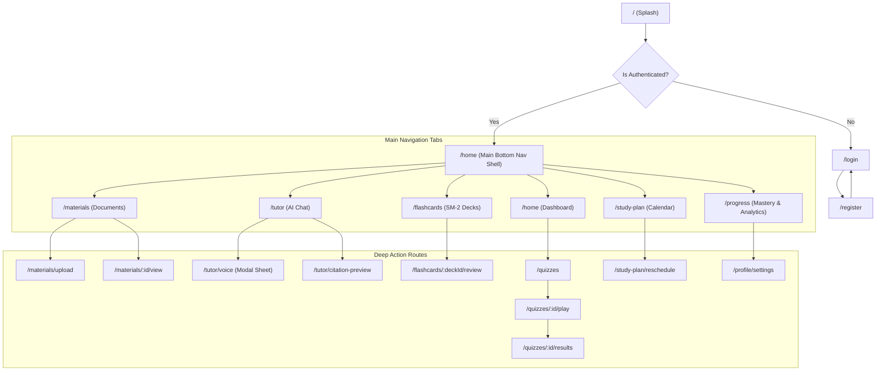

# Mobile Architecture & Design System Documentation
## LearnMate AI — Flutter 3.x Cross-Platform Client

---

## 1. Flutter Mobile Architecture Overview

The LearnMate AI mobile client is engineered using **Flutter 3.x & Dart 3.x** following the **Feature-First Clean Architecture** with **Riverpod 2.x** for state management and **GoRouter 14.x** for declarative navigation.

```mermaid
graph TD
    subgraph UI_Layer ["Presentation Layer (Widgets & Screens)"]
        Screens["Feature Screens<br/>- Dashboard<br/>- AI Tutor<br/>- Voice Sheet<br/>- Quiz Runner<br/>- 3D Flashcards<br/>- Calendar Planner"]
        Components["Shared Design System Components<br/>- Glassmorphic Cards<br/>- 3D Flip Transform<br/>- Animated Waveform<br/>- Source Citation Bottom-Sheet"]
    end

    subgraph State_Layer ["State Management Layer (Riverpod 2.x)"]
        Controllers["StateNotifier & AsyncNotifier Controllers<br/>- AuthController<br/>- TutorChatController<br/>- FlashcardReviewController<br/>- QuizController<br/>- StudyPlanController"]
        Providers["Dependency Injection Providers<br/>- DioApiClientProvider<br/>- OfflineSyncManagerProvider<br/>- AudioEngineProvider"]
    end

    subgraph Core_Layer ["Core & Infrastructure Layer"]
        Network["Dio Network Client + JWT Interceptors"]
        Offline["SQLite Local Database + SharedPreferences"]
        Audio["Audio Recorder (m4a) + AudioPlayer"]
        Sync["OfflineSyncManager (Mutation Queue + Connectivity)"]
    end

    Screens --> Controllers
    Components --> Controllers
    Controllers --> Providers
    Providers --> Network
    Providers --> Offline
    Providers --> Audio
    Offline --> Sync
```



---

## 2. GoRouter Declarative Routing Map (15 App Routes)



---

## 3. UI/UX Design System & Color Palette

### 3.1 Color Palette Tokens (Modern Glassmorphic Dark Theme)
- **Background Primary**: `#0B0F19` (Deep Obsidian Void)
- **Surface / Card Background**: `#151D2E` (Frosted Glass with 15% opacity blur)
- **Primary Brand Accent**: `#6366F1` (Vibrant Indigo Gradient to `#8B5CF6` Electric Purple)
- **Secondary Accent**: `#06B6D4` (Cyan Energy)
- **Success / Mastery Accent**: `#10B981` (Emerald Green)
- **Warning Accent**: `#F59E0B` (Amber Orange)
- **Destructive / Error Accent**: `#EF4444` (Crimson Red)
- **Text Primary**: `#FFFFFF` (Crisp Pure White)
- **Text Secondary**: `#94A3B8` (Muted Slate Grey)

### 3.2 Typography Tokens (Google Fonts: Plus Jakarta Sans / Outfit)
- **Display Heading 1**: `Outfit`, 28pt, SemiBold (`w700`), Letter Spacing: `-0.5px`
- **Section Heading 2**: `Plus Jakarta Sans`, 20pt, Medium (`w600`)
- **Body Text**: `Plus Jakarta Sans`, 15pt, Regular (`w400`), Line Height: `1.5`
- **Code & Citations**: `Fira Code` / `JetBrains Mono`, 13pt, Regular (`w400`)

---

## 4. 3D Perspective Flashcard Transform (Matrix4 Rotation)

```dart
Transform(
  transform: Matrix4.identity()
    ..setEntry(3, 2, 0.0015) // 3D Perspective entry
    ..rotateY(_flipAnimation.value * pi),
  alignment: Alignment.center,
  child: _flipAnimation.value < 0.5 
      ? FlashcardFrontView(question: card.frontQuestion, hint: card.hint) 
      : Transform(
          transform: Matrix4.identity()..rotateY(pi),
          alignment: Alignment.center,
          child: FlashcardBackView(answer: card.backAnswer, citation: card.citationPage),
        ),
)
```

---

## 5. Offline-First Caching & Background Sync Strategy

```
+-----------------------------------------------------------------------------------+
|                            OFFLINE CACHE ENGINE                                   |
+------------------------------------+----------------------------------------------+
| 📦 Local SQLite Storage            | • Caches flashcard decks, cards & SM-2 state |
|                                    | • Caches active study plans & sessions       |
|                                    | • Caches recent conversation messages        |
+------------------------------------+----------------------------------------------+
| 🔄 Pending Mutations Queue         | • Queues offline flashcard ratings (0-5)     |
|                                    | • Queues completed study session updates     |
|                                    | • Preserves UTC millisecond timestamps       |
+------------------------------------+----------------------------------------------+
| 🌐 Connectivity Listener           | • Monitors WiFi / Mobile data state changes  |
|                                    | • Triggers background batch sync upon connect|
+------------------------------------+----------------------------------------------+
```

---
