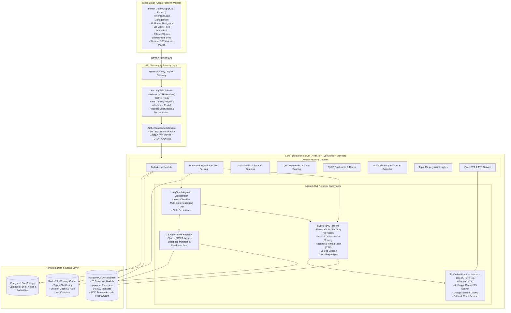
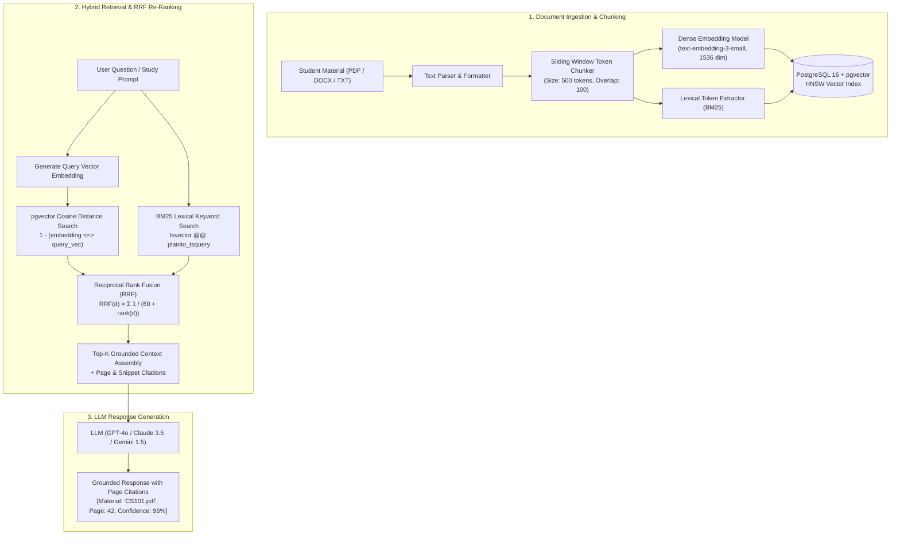
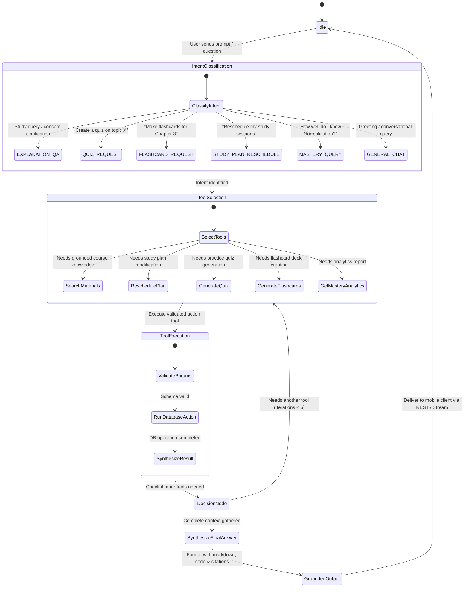
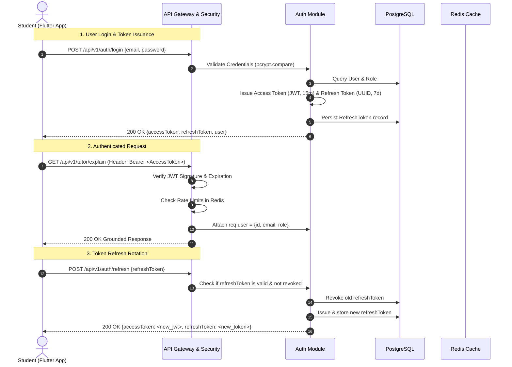

# System Architecture Document
## LearnMate AI — Enterprise Multi-Layer Architecture

---

## 1. High-Level Architecture Diagram (C4 Container View)



---

## 2. Backend Layered Architecture

The Node.js/TypeScript backend adheres to the **Clean Modular Architecture** pattern, ensuring strict separation of concerns, testability, and maintainability:

```
backend/src/
├── app.ts                 # Express application bootstrap & middleware registration
├── server.ts              # HTTP server listener & graceful shutdown handlers
├── config/                # Environment variables, constants & config loaders
├── common/                # Shared utilities, custom errors, loggers, response helpers
│   ├── errors/            # AppError, UnauthorizedError, NotFoundError, ConflictError
│   ├── middlewares/       # errorHandler, authMiddleware, rateLimiter, requestValidator
│   └── logger/            # Structured JSON logger with timestamps & log levels
├── database/              # Prisma client singleton, connection pooling & test fallbacks
├── modules/               # Domain-specific feature packages
│   ├── auth/              # JWT issuance, refresh rotation, password hashing
│   ├── users/             # User profile management & preferences
│   ├── materials/         # Document upload, PDF parsing, text chunking
│   ├── rag/               # Hybrid dense/sparse vector search & RRF ranking
│   ├── ai/                # Unified AI provider interface (OpenAI, Claude, Gemini)
│   ├── agents/            # LangGraph state machine & multi-turn reasoning graph
│   ├── tools/             # 13 validated database action tools
│   ├── tutor/             # 5 pedagogical explanation modes & citations
│   ├── quizzes/           # AI quiz generation, submission evaluation & grading
│   ├── flashcards/        # SuperMemo SM-2 spaced repetition engine
│   ├── study-plans/       # Adaptive scheduling & conversational rescheduling
│   ├── progress/          # Topic mastery scoring, streaks & AI insights
│   └── voice/             # OpenAI Whisper STT & speech synthesis (TTS)
└── tests/                 # 16 Vitest unit & integration test suites
```

---

## 3. Hybrid RAG (Retrieval-Augmented Generation) Pipeline



### RRF Mathematical Formulation
For each retrieved document chunk $d \in D$:
$$RRF(d) = \frac{1}{k + rank_{dense}(d)} + \frac{1}{k + rank_{sparse}(d)}$$
*Where $k = 60$ is the standard smoothing constant preventing low-rank dominance.*

---

## 4. LangGraph Agent State Machine & Tool Execution Loop



---

## 5. Security & Authentication Architecture



---

## 6. Mobile Architecture & Design System

The mobile client is engineered using **Flutter 3.x + Dart 3.x** following the **Feature-First Architecture** with **Riverpod 2.x** and **GoRouter 14.x**:

```
mobile/lib/
├── main.dart                      # App entry point & ProviderScope initialization
├── core/
│   ├── network/                   # Dio HTTP client, JWT interceptor, refresh queue
│   ├── router/                    # GoRouter configuration with 15 authenticated routes
│   ├── theme/                     # Glassmorphic Dark & Light theme design tokens
│   ├── offline/                   # SQLite local cache & offline mutation sync manager
│   ├── audio/                     # Audio recorder & player controller for Voice AI
│   └── utils/                     # Formatters, date helpers, markdown renderers
└── features/                      # Domain feature modules (UI + Riverpod Providers)
    ├── auth/                      # Login, Registration, Splash & Token Provider
    ├── home/                      # Home Dashboard, Streaks & Quick Actions
    ├── materials/                 # Document Uploader, Chunk Progress & PDF Viewer
    ├── tutor/                     # Grounded AI Tutor Chat & Citation Sheet
    ├── voice/                     # Voice Tutor Modal & Soundwave Visualizer
    ├── quiz/                      # Interactive Quiz Runner, Timers & Score Cards
    ├── flashcards/                # 3D Matrix4 Flip Cards & SM-2 Rating Controls
    ├── study_plan/                # Study Timeline Calendar & Reschedule Modal
    └── progress/                  # Mastery Heatmaps, AI Insights & Profile Settings
```

---
