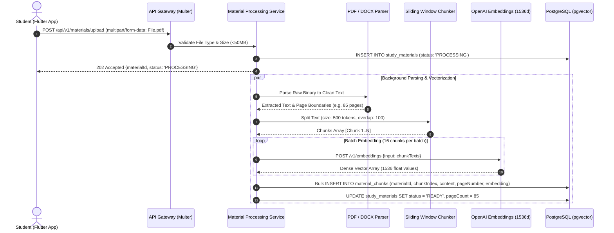
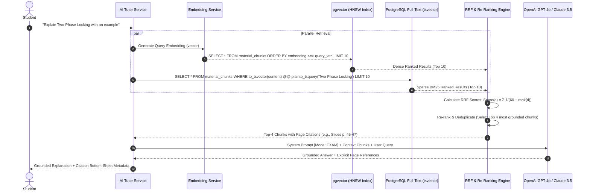
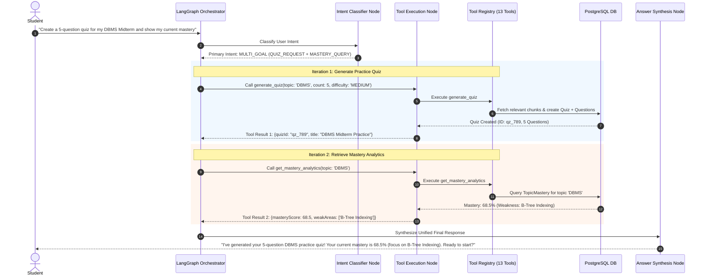
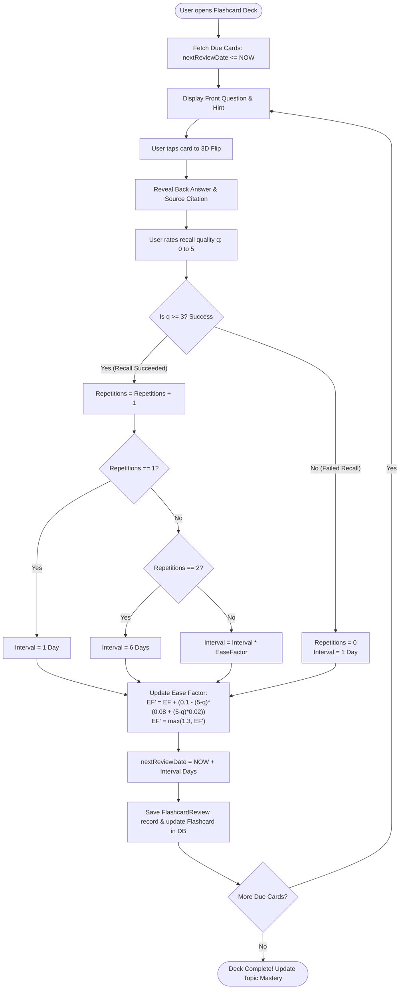
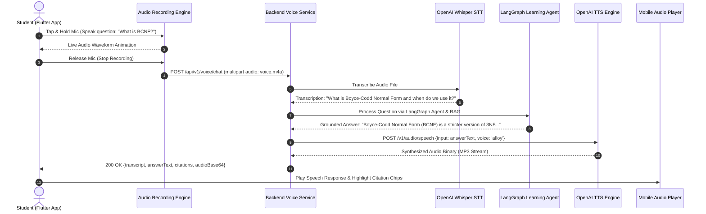
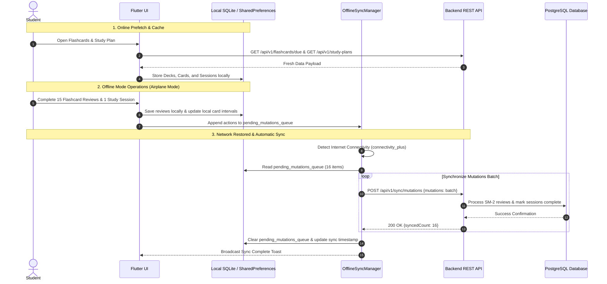

# System Workflows & Sequence Diagrams
## LearnMate AI — End-to-End Operational Workflows

---

## 1. Document Ingestion & Vector Indexing Pipeline

---

## 2. Hybrid RAG Retrieval & Reciprocal Rank Fusion (RRF) Workflow

---

## 3. LangGraph Agentic Orchestrator & Tool Calling Workflow

---

## 4. SuperMemo SM-2 Spaced Repetition Review Loop

---

## 5. Voice AI Tutor (STT -> LLM -> TTS) Execution Flow

---

## 6. Mobile Offline-First Storage & Synchronization Flow

---
